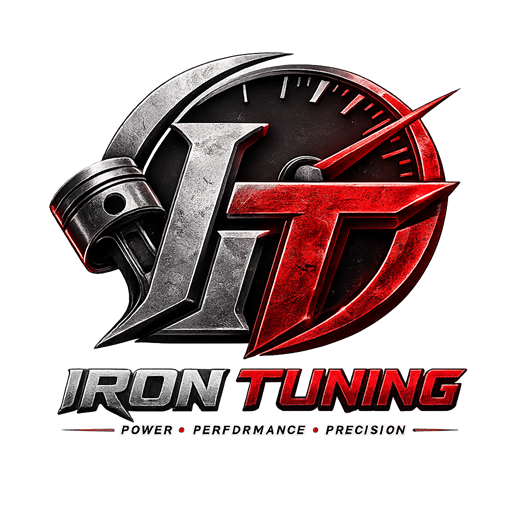

<!-- PROJECT LOGO -->
 

  

  <h3 align="center">آیرون تونینگ</h3>

  

    نرم‌افزار مدیریت مالی و حسابداری تعمیرگاه خودرو
     
     
    <a href="https://github.com/jalaljaleh/AutoLedger/issues">Report Bug</a>
    ·
    <a href="https://github.com/jalaljaleh/AutoLedger/issues">Request Feature</a>
  

  
  
  

## 📍 درباره‌ی آیرون تونینگ

**آیرون تونینگ** مرکز تخصصی تقویت و بهینه‌سازی خودرو در سنندج است. ما با بهره‌گیری از تجهیزات پیشرفته و کادری مجرب، خدماتی نظیر ریمپ ECU، افزایش شتاب و گشتاور، بهینه‌سازی مصرف سوخت و ارتقای سخت‌افزاری موتور را ارائه می‌دهیم.  
این نرم‌افزار با هدف دیجیتالی‌سازی فرایندهای مالی و حسابداری همین مجموعه طراحی شده است.

📌 **آدرس:** سنندج، عباس‌آباد، خیابان ۱ صنعتگران، صنعت‌گران ۱، بین صنعتگران ۵ و ۶، شهرک صنعتی شماره یک  
📞 **تلفن تماس:** ۰۹۱۸۶۵۰۶۵۸۴  
🗺️ **موقعیت روی نقشه:** [مشاهده در نشان](https://nshn.ir/c4_bQXUXW5bMpz)

---

## Features

- **Income & Expense Tracking** – Record all financial transactions categorized by service type (ECU remap, hardware upgrades, diagnostics, etc.) with daily/weekly summaries.
- **Invoice Management** – Generate official and informal invoices; print, save as PDF, or share directly with customers.
- **Cheque & Debt Monitoring** – Track received/issued cheques with automatic due‑date reminders and customer outstanding balances.
- **Financial Reporting** – Profit & loss statements, monthly revenue charts, expense breakdowns, and cash‑in‑hand reports.
- **Local‑First & Offline** – All data stored locally in SQLite, no internet required; planned future cloud backup.
- **Modular Architecture** – Clean MVVM design, easily extendable (inventory, appointments, customer notifications, etc.).
- **Cross‑Platform** – Built with .NET MAUI, runs on Windows, Android, and iOS from a single codebase.

## ✨ ویژگی‌های کلیدی نرم‌افزار

- 📊 **ثبت درآمدها و هزینه‌ها**  
  تفکیک انواع تراکنش‌های مالی بر اساس دسته‌بندی خدمات تعمیرگاهی (ریمپ، سخت‌افزار، مشاوره و ...)

- 🧾 **مدیریت فاکتورها**  
  صدور فاکتور رسمی و غیررسمی، قابلیت چاپ و اشتراک‌گذاری سریع با مشتریان

- 📅 **ردیابی چک و بدهی‌ها**  
  یادآوری سررسید چک‌های دریافتی/پرداختی و مدیریت حساب مشتریان دائمی

- 📈 **گزارش‌گیری مالی**  
  گزارش سود و زیان، نمودارهای درآمد ماهیانه، جزئیات هزینه‌ها و موجودی صندوق

- ☁️ **پشتیبان‌گیری ابری (در نسخه‌های آینده)**  
  ذخیره‌ی امن اطلاعات روی فضای ابری جهت جلوگیری از دست‌رفتن داده‌ها

- 🧩 **طراحی ماژولار**  
  قابلیت افزودن امکانات جدید با کمترین تغییر در ساختار اصلی برنامه
  

Designed & developed with ❤️ by the Iron Tuning technical team
Feel the power.
